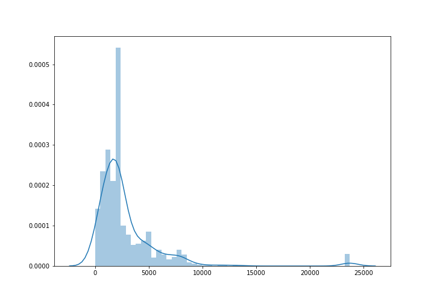

[](http://quantlet.de/)

## [](http://quantlet.de/) **SC-classification-significance** [](http://quantlet.de/)

```yaml

Name of Quantlet: 'SC-classification-significance'

Published in: 'Hype or Hope? Understanding Smart Contracts.'

Description: 'This Quantlet is dedicated to test of the difference in performance of different training modes. The wilcoxon test is used.'

Quantlet Scripts Description:
- SC-classification-significance.ipynb wilcoxon test on the performance


Keywords: 'machine learning, source code, significance testing, nonparametrics, wilcoxon'

Author: 'Elizaveta Zinovyeva, Raphael Constantin Georg Reule'

Submitted:  'Feb 21 2021 by Elizaveta Zinovyeva'

Datafile:
- dapps_source_code_parsed_open_source_2021-01-08.csv created through SC-Dapp-scraping Quantlet

Additional Notes:
- some of the datafiles used in the scripts come from different Quantlets, if it is the case, you would need to run the code specified in the Datafile field before running this Quantlet
- be aware of the redundancies in the code. The code presented here is not made for production (neither it is optimized for production). It's purpose is solely to see and to be able to compare all the numbers presented in the paper

```



### [IPYNB Code: SC-classification-significance.ipynb](SC-classification-significance.ipynb)


automatically created on 2021-02-26