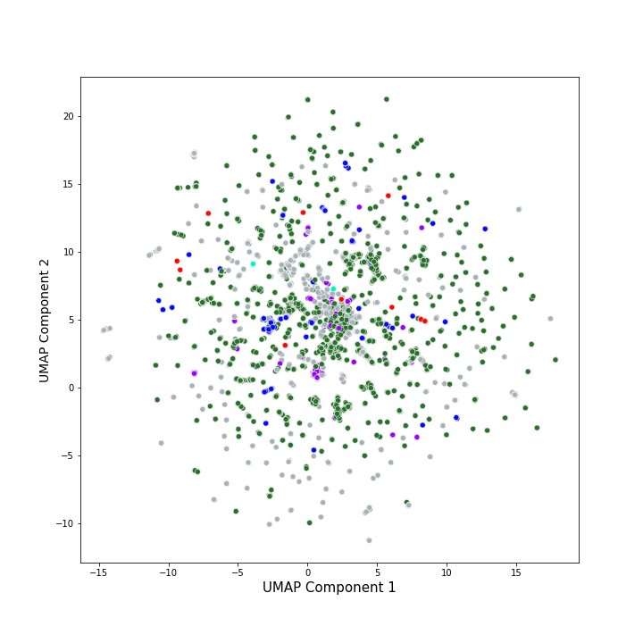

[](http://quantlet.de/)

## [](http://quantlet.de/) **SC_classification** [](http://quantlet.de/)

```yaml

Name of Quantlet: 'SC_classification'

Published in: 'Hype or Hope? Understanding Smart Contracts.'

Description: 'This Quantlet is dedicated to classification of the Solidity source code using machine learning methods.
We differentiate between traditional machine learning methods and deep learning.
There are three modes for training these methods: on the source code, on the source code without comments and on only comments.
Moreover, deep pre-trained transformer BERT - the state-of-the-art approach in the NLP were used on the comments mode.
Furthermore, additional feature extraction of the most important block names of the Solidity
code was made and the best performing ML algorithm was trained on these features.'

Quantlet Scripts Description:
- SC-classification.ipynb traditional ML methods on the Solidity source code
- SC-classification-DL.ipynb deep learning methods  on the Solidity source code
- SC-classification-BERT.ipynb transformer BERT on the comments of the Solidity source code
- SC-classification-code-features.ipynb traditional ML methods on the Solidity extracted features
- SC-classification-plot.ipynb unlabelled data classified with Ridge, visualization of result
- dl_requirements.txt python packages installed during DL training
- tml_requirements.txt python packages installed during TML training
- models.py script containing functions formulating neural networks

Keywords: 'machine learning, source code, ML, DL, transformers, BERT'

Author: 'Elizaveta Zinovyeva, Raphael Constantin Georg Reule'

Submitted:  'Jan 08 2021 by Elizaveta Zinovyeva'

Datafile:
- dapps_source_code_parsed_open_source_2021-01-08.csv created through SC-Dapp-scraping Quantlet
- open_source_parsed_16thousand.csv created through SC-open-source-source-code-scraping Quantlet

Additional Notes:
- some of the datafiles used in the scripts come from different Quantlets, if it is the case, you would need to run the code specified in the Datafile field before running this Quantlet
- for SC-classification-DL.ipynb you would need to create additional folders models, models/cv and models/final
- be aware of the redundancies in the code. The code presented here is not made for production (neither it is optimized for production). It's purpose is solely to see and to be able to compare all the numbers presented in the paper

```

