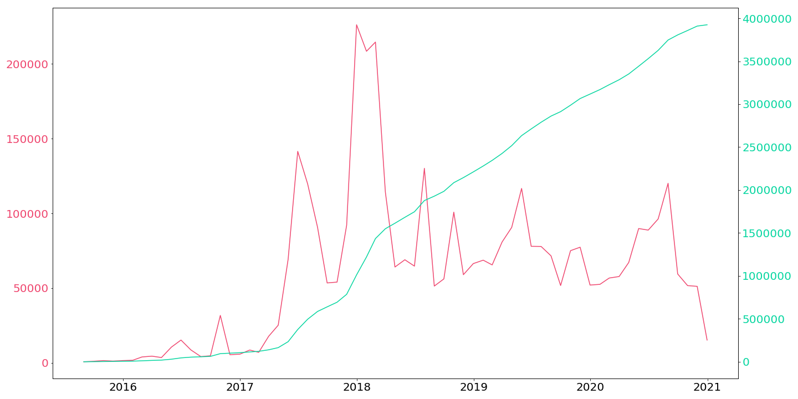
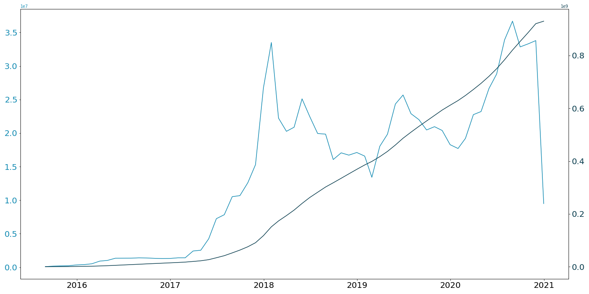

[](http://quantlet.de/)

## [](http://quantlet.de/) **SC_energy_consumption** [](http://quantlet.de/)

```yaml

Name of Quantlet: 'SC_energy_consumption'

Published in: 'Hype or Hope? Understanding Smart Contracts.'

Description: 'This Quantlet is dedicated to visualization of time-series of energy consumption of Ethereum'

Quantlet Scripts Description:
- SC_energy_consumption.ipynb visualizing energy consumption of Ethereum Transactions time-series


Keywords: 'energy, visualization, time-series, Ethereum, smart contracts'

Author: 'Elizaveta Zinovyeva, Raphael Constantin Georg Reule'

Submitted:  'Dec 10 2020 by Elizaveta Zinovyeva'

Datafile:
- EECI_TWh - TWh per Year-2020-12-09.csv the file obtained through https://digiconomist.net/ethereum-energy-consumption


Additional Notes:
- you will need to create the additional data folder and store the first two datafiles there
- be aware of the redundancies in the code. The code presented here is not made for production (neither it is optimized for production). It's purpose is solely to see and to be able to compare all the numbers presented in the paper

```




